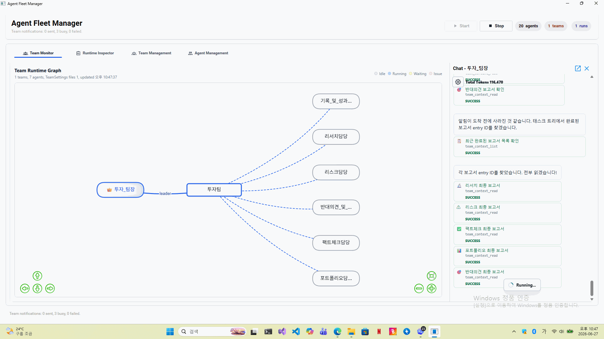

# AgentFleetManager.exe

`AgentFleetManager.exe`는 JioAgent 배포본에서 여러 에이전트를 한 화면에서 관리하는 운영용 GUI입니다. 개별 `AgentConsole.exe` 프로세스를 직접 하나씩 실행하는 대신, Fleet Manager에서 에이전트 시작/중지, 팀 구성, 팀 실행 상태, TeamRuntime 그래프, 에이전트별 채팅 화면을 모아서 다룰 수 있습니다.

## 데모 영상



## 무엇을 하는 프로그램인가

AgentFleetManager는 여러 AI 에이전트를 “팀”으로 묶어 작업시키기 위한 관리 앱입니다.

- 등록된 에이전트 목록을 읽고 실행합니다.
- 각 에이전트의 상태와 제어 URL을 관리합니다.
- 팀 설정을 만들고 수정합니다.
- TeamRuntime 작업 흐름을 그래프로 보여줍니다.
- 팀장, 작업자, 리뷰어, 문서화 담당 같은 역할 기반 협업을 운영합니다.
- 에이전트별 채팅 패널을 열어 개별 에이전트 상태를 확인합니다.
- 실행 중인 팀 작업, 보고, 질문, 대기 상태를 한 화면에서 추적합니다.

핵심 실행 파일은 이 파일입니다.

```text
AgentFleetManager.exe
```

## 빠른 실행

저장소를 받은 뒤 배포 폴더에서 실행합니다.

```powershell
cd JioAgent
.\AgentFleetManager.exe
```

GUI를 띄우지 않고 시작 가능 여부만 확인하려면:

```powershell
.\AgentFleetManager.exe --startup-smoke
```

`--startup-smoke`는 배포 폴더, 설정 파일, 서비스 초기화 문제가 있는지 빠르게 확인할 때 유용합니다.

## 요구 사항

- Windows
- .NET 8 Desktop Runtime 또는 .NET 8 SDK
- LLM API 키
- AgentConsole/ApiProxy 실행에 필요한 네트워크 접근
- MCP 기능을 사용할 경우 Python, Playwright 등 각 MCP 서버의 런타임

.NET 8 Desktop Runtime 설치:

```powershell
winget install Microsoft.DotNet.DesktopRuntime.8
```

설치 확인:

```powershell
dotnet --list-runtimes
```

`Microsoft.WindowsDesktop.App 8.x`가 보이면 WPF 기반 Fleet Manager 실행에 필요한 런타임이 준비된 것입니다.

## 화면 구성

AgentFleetManager의 주요 화면은 네 개의 탭으로 구성됩니다.

| 탭 | 설명 |
| --- | --- |
| Team Monitor | 팀 실행 그래프, 팀 런 상태, 에이전트별 채팅 패널을 확인합니다. |
| Runtime Inspector | 런타임 상태와 실행 정보를 점검합니다. |
| Team Management | 팀 생성, 수정, 팀원 구성, 팀 설정 관리를 수행합니다. |
| Agent Management | 에이전트 생성, 수정, 시작/중지, 역할 설정을 수행합니다. |

## Team Monitor

Team Monitor는 AgentFleetManager의 중심 화면입니다. 팀과 에이전트 관계를 그래프로 보여주고, 각 에이전트가 어떤 역할로 연결되어 있는지 시각적으로 확인할 수 있습니다.

주요 기능:

- 팀 런타임 그래프 표시
- 팀장과 팀원 관계 표시
- 에이전트 상태 구분: Idle, Running, Waiting, Issue
- 팀 수, 에이전트 수, 실행 중인 run 수 표시
- 그래프 노드 클릭으로 에이전트 채팅 패널 열기
- 에이전트별 최근 응답, 도구 호출, 성공/실패 상태 확인

그래프 UI 파일:

```text
Web/team-runtime-graph.html
Web/vis-network.min.js
```

## Agent Management

Agent Management에서는 Fleet Manager가 실행할 에이전트 프로필을 관리합니다.

에이전트 설정 파일은 아래 폴더에 저장됩니다.

```text
AgentSettings/*.agentconsole.args.json
```

현재 배포본에는 다음과 같은 역할 기반 에이전트 설정이 포함되어 있습니다.

| 에이전트 | 역할 |
| --- | --- |
| CodingTeamLeader | 팀장, 작업 분배와 결과 취합 |
| jio, kiyoon | 코드 작성 담당 |
| hanroro, hipi | 코드 리뷰 담당 |
| hyori | 요구사항 분석 담당 |
| jaeseok | 아키텍처 담당 |
| baeksoo | 테스트 담당 |
| rain | 문서화 담당 |
| TaskDecomposer | 작업 분해 담당 |
| WebAppTester | 웹앱 테스트 담당 |

그 외 인사팀, 생산팀, 총괄장 같은 예시 업무 에이전트도 포함되어 있습니다.

Agent Management에서 관리하는 내용:

- 에이전트 이름
- 역할 설명
- 제어 포트/URL
- 시작 시 활성화할 Skill
- 사용할 수 있는 Skill
- 활성화할 MCP 서버
- AgentConsole 실행 인자

## Team Management

Team Management에서는 여러 에이전트를 하나의 팀으로 묶습니다.

팀 설정 파일:

```text
TeamSettings/*.team.json
```

현재 배포본에는 예시 팀 설정 파일이 포함되어 있습니다.

```text
12j3io.team.json
12jk3kj123.team.json
12kj3213.team.json
test123.team.json
```

팀 설정은 TeamRuntime 작업 흐름의 기준이 됩니다.

- 팀 이름
- 팀 설명
- 팀장 에이전트
- 팀원 목록
- 작업 한도
- 휴지통 한도
- 팀 실행 컨텍스트

Fleet Manager는 팀 설정을 기반으로 팀별 시스템 지시문과 작업 라우팅 정보를 구성합니다.

## Start / Stop

상단의 `Start`와 `Stop` 버튼은 등록된 에이전트 실행 상태를 관리합니다.

- Start: 설정된 에이전트 프로세스를 시작합니다.
- Stop: 실행 중인 에이전트 프로세스를 중지합니다.
- agents 배지: 등록/관리 대상 에이전트 수를 보여줍니다.
- teams 배지: 팀 설정 수를 보여줍니다.
- runs 배지: 현재 추적 중인 팀 실행 수를 보여줍니다.

Fleet Manager는 `AgentConsole.exe`를 백그라운드 프로세스로 실행하고, 각 에이전트의 Control API 상태를 확인합니다.

## 설정 파일

AgentFleetManager가 주로 참조하는 설정은 아래와 같습니다.

### 포트와 실행 범위

```text
config/agent.endpoints.json
```

현재 기본값:

```json
{
  "proxyUrl": "http://localhost:5058",
  "controlUrl": "http://localhost:5068",
  "fleet": {
    "firstControlPort": 5068,
    "instanceCount": 20
  }
}
```

의미:

- `proxyUrl`: AgentConsole이 사용할 로컬 ApiProxy 주소
- `controlUrl`: 첫 번째 에이전트 제어 서버 주소
- `fleet.firstControlPort`: Fleet Manager가 할당할 첫 포트
- `fleet.instanceCount`: 관리 가능한 에이전트 인스턴스 수

### 에이전트 프로필

```text
AgentSettings/*.agentconsole.args.json
```

각 에이전트를 어떤 이름과 역할, Skill, MCP 설정으로 실행할지 정의합니다.

### 팀 설정

```text
TeamSettings/*.team.json
```

팀장, 팀원, 팀 설명, 작업 정책을 정의합니다.

### 런타임 설정

```text
config/agent.runtime.json
```

AgentConsole 실행 시 사용할 공통 런타임 옵션입니다. Skill 루트, MCP 서버 루트, 요청 제한 시간, 메모리 압축 등의 설정이 들어갑니다.

### API 프록시 설정

```text
ApiProxy/appsettings.json
```

LLM API BaseUrl, 모델, API 키 설정은 여기서 관리합니다.

## API 키 설정

LLM 호출은 `ApiProxy`가 담당합니다. 실제 API 키는 `ApiProxy/appsettings.json` 또는 환경변수로 설정합니다.

환경변수 방식 예:

```powershell
$env:DEEPSEEK_API_KEY = "your-api-key"
```

그리고 `ApiProxy/appsettings.json`에서:

```json
"ApiKeyEnvironmentVariable": "DEEPSEEK_API_KEY"
```

공개 저장소에는 실제 API 키를 넣지 마세요.

## 배포 폴더 구조

AgentFleetManager 중심으로 보면 중요한 파일은 다음과 같습니다.

```text
JioAgent/
  AgentFleetManager.exe
  AgentConsole.exe
  AgentRuntime.dll
  TeamRuntime.dll
  ApiProxy/
    ApiProxy.exe
    appsettings.json
  AgentSettings/
    *.agentconsole.args.json
  TeamSettings/
    *.team.json
  TeamRuntimeStore/
    team-runs/
    team-context/
  config/
    agent.endpoints.json
    agent.runtime.json
    team-worker-agents.json
  Web/
    team-runtime-graph.html
    vis-network.min.js
  Skills/
  McpServers/
  logs/
```

## 공개 저장소에서 제외한 데이터

이 저장소는 실행 이력과 대화 내용을 공개하지 않도록 아래 데이터를 제외합니다.

```gitignore
logs/
TeamRuntimeStore/
AgentSettings/*.conversation.json
*.log
__pycache__/
*.pyc
```

특히 `TeamRuntimeStore/`와 `AgentSettings/*.conversation.json`에는 실제 작업 내용, 대화 이력, 내부 보고서가 들어갈 수 있습니다. 공개 저장소에는 올리지 않는 것이 안전합니다.

## 문제 해결

### 실행이 안 되는 경우

먼저 런타임을 확인합니다.

```powershell
dotnet --list-runtimes
```

`Microsoft.WindowsDesktop.App 8.x`가 없으면 .NET 8 Desktop Runtime을 설치하세요.

### GUI가 뜨기 전에 종료되는 경우

초기화 점검 명령을 실행합니다.

```powershell
.\AgentFleetManager.exe --startup-smoke
```

이 명령으로 설정 파일, 배포 루트, 서비스 초기화 문제를 좁힐 수 있습니다.

### 에이전트 목록이 비어 있는 경우

아래 파일들이 있는지 확인합니다.

```text
AgentSettings/*.agentconsole.args.json
config/team-worker-agents.json
```

AgentFleetManager는 배포 루트 기준으로 설정 파일을 읽습니다. 다른 폴더에서 복사해 실행하면 상대 경로가 꼬일 수 있으니 `JioAgent` 배포 폴더에서 실행하세요.

### 팀이 보이지 않는 경우

아래 폴더를 확인합니다.

```text
TeamSettings/
```

팀 파일이 손상되었거나 비어 있으면 Team Management와 Team Monitor에 정상 표시되지 않을 수 있습니다.

### AgentConsole이 시작되지 않는 경우

1. `AgentConsole.exe`가 같은 폴더에 있는지 확인합니다.
2. `config/agent.endpoints.json`의 포트 범위를 확인합니다.
3. 이미 같은 포트를 쓰는 프로세스가 있는지 확인합니다.
4. `ApiProxy/appsettings.json`의 API 키와 모델 설정을 확인합니다.

### Team Monitor가 `Waiting for FleetManager data...`에 머무는 경우

아래 파일이 있는지 확인합니다.

```text
Web/team-runtime-graph.html
Web/vis-network.min.js
```

그리고 Fleet Manager가 팀/에이전트 상태를 읽을 수 있도록 `AgentSettings/`, `TeamSettings/`, `TeamRuntimeStore/` 경로가 배포 루트 기준으로 올바른지 확인합니다.

## 개발/재배포 참고

원본 개발 트리에서 배포본을 다시 만들 때는 다음 스크립트를 사용합니다.

```powershell
D:\src\jio_agent\jio_agent\deploy\publish-deploy.ps1
```

재배포 전에는 실행 중인 `AgentFleetManager.exe`, `AgentConsole.exe`, `ApiProxy.exe`가 배포 파일을 잠그고 있지 않은지 확인하세요.
